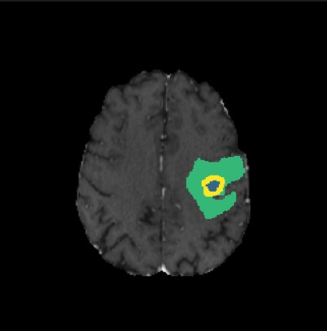

# 3D Brain Tumor Segmentation with BraTS Dataset

3D U-Net for brain tumor segmentation using the BraTS 2021/2023 dataset.

## Features

- **Complete Pipeline**: From raw BraTS data to trained model deployment
- **3D U-Net Architecture**: Residual blocks, instance normalization, deep supervision
- **Advanced Preprocessing**: Resampling, normalization, foreground cropping, patch extraction
- **Robust Training**: Mixed precision, gradient clipping, early stopping, cross-validation
- **Comprehensive Evaluation**: Dice, Hausdorff95, volumetric correlation
- **Explainability**: Grad-CAM and Integrated Gradients for model interpretation
- **Production Ready**: Docker support, comprehensive testing, monitoring

## Quick Start

### Environment Setup
```bash
# Create virtual environment
python -m venv venv
source venv/bin/activate

# Install dependencies
pip install -r requirements.txt

# Or create conda environment
conda env create -f environment.yml
conda activate brats-seg
```

### Data Preparation
```bash
# Download BraTS dataset from Kaggle (HDF5 format)
python scripts/download_kaggle_data.py

# Or manually download BraTS dataset to ./data/raw/BraTS2020_training_data/
# Run preprocessing
python scripts/preprocess_data.py --data_path ./data/raw/BraTS2020_training_data/ --output_path ./data/preprocessed/
```

### Training
```bash
# Single fold training
python scripts/train.py --config configs/baseline.yaml --fold 0

# HDF5 real training (current working version)
python train_hdf5_real.py --data_path ./data/raw/BraTS2020_training_data/content/data --fold 0 --epochs 200

# 3-fold cross-validation optimized for H100
bash scripts/parallel_cv_3fold_h100.sh --data_path ./data/raw/BraTS2020_training_data/content/data

# Alternative 5-fold cross-validation
bash scripts/run_cv.sh
```

### Inference
```bash
# Run inference on new data
python scripts/inference.py --model outputs/fold_0/checkpoints/epoch_best.pth --input_dir ./test_data/ --output_dir ./predictions/
```

### Evaluation
```bash
# Evaluate model performance
python scripts/evaluate_fold.py --fold 0 --output_dir ./outputs/fold_0/
```

### Quick Demo
```bash
# Check training progress
bash check_training.sh
```

## Results

### Segmentation Examples

Ground Truth :



Predicted Segmentation :


## Project Structure

```
brats-3d-segmentation/
├── src/                    # Source code modules
│   ├── data/              # Data loading and preprocessing
│   ├── models/            # U-Net architecture
│   ├── losses/            # Loss functions (Dice, Focal Tversky)
│   ├── metrics/           # Evaluation metrics
│   ├── engine/            # Training and validation loops
│   ├── postprocessing/    # Connected components, hole filling
│   └── xai/               # Explainability tools
├── scripts/               # Training and inference scripts
├── configs/               # YAML configuration files
├── tests/                 # Unit tests
└── outputs/               # Results, checkpoints, visualizations
```

## Performance

Expected performance on BraTS validation set:
- **Whole Tumor Dice**: > 0.88
- **Tumor Core Dice**: > 0.82
- **Enhancing Tumor Dice**: > 0.78
- **Inference Time**: < 60 seconds per case
- **Memory Usage**: < 16GB GPU during inference

## Citation

If you use this code, please cite:
```bibtex
@software{brats_3d_segmentation,
  title = {3D Brain Tumor Segmentation with BraTS Dataset},
  author = {Aashan Javed},
  year = {2024},
  url = {https://github.com/your-repo/brats-3d-segmentation}
}
```